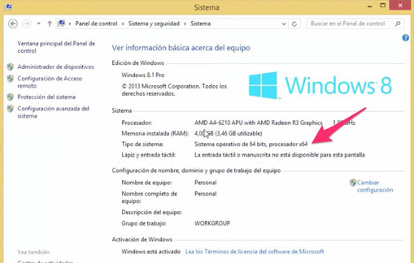
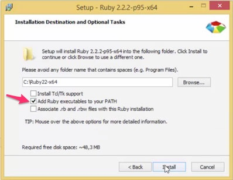
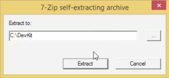

# Instalación en Windows

Para instalar Ruby en Windows debes descargar e instalar dos paquetes independientes: Ruby y DevKit. Si quieres ver un video que muestra el proceso con las instrucciones que se encuentran a continuación [haz click acá](https://makeitreal.wistia.com/medias/s3dvclbol2).

## Instalación de Ruby

Los pasos que debes realizar para instalar Ruby son los siguientes:

1. Ingresa a [esta página](https://rubyinstaller.org/downloads/) y descarga la versión **Ruby 2.3.3 (x64)** (si tu procesador y sistema operativo son de 64 bits) o **Ruby 2.3.3** (si tu procesador o sistema operativo son de 32 bits).

   **Nota**: Para verificar si tu computador es de 32 o 64 bits ingresa a **Panel de Control** > **Sistema y Seguridad** > **Sistema** y busca una línea que dice **Tipo de Sistema**.

   

2. Ejecuta el instalador que descargaste en el paso anterior.

3. Sigue las instrucciones de instalación. Sin embargo, ten cuidado cuando veas la siguiente pantalla y selecciona la opción **Add Ruby Executables to your PATH** como se muestra en la siguiente imagen:

   

   **Nota**: Memoriza o copia la ruta en donde se va a instalar Ruby porque lo vas a necesitar más adelante.

Eso es todo. Ahora devemos instalar el Kit de Desarrollo de Ruby.

## Instalación de DevKit

1. Ingresa a la misma página desde la que descargaste Ruby y busca un título llamado **DEVELOPMENT KIT** en la columna izquierda.

2. Descarga la versión para 32 o 64 bits dependiendo de tu equipo.

3. Ejecuta el instalador.

4. Cuando te pida dónde extraer el paquete cambia la ruta por `C:\DevKit` como se muestra en la siguiente imagen:

   

5. En el **Símbolo del Sistema** ejecuta los siguiente comandos (omite el símbolo `>`):

   ```
   > C:\DevKit
   > ruby dk.rb init
   ```

6. Abre el archivo `C:\DevKit\config.yml` con **Bloc de Notas** u otro editor de texto y verifica que la última línea tenga la ruta donde instalaste Ruby. Si no es así agregala manualmente. Por ejemplo, si la instalación quedó en `C:\Ruby23-x64`, la siguiente línea debe existir en `config.yml`:

   ```
   - C:\Ruby23-x64
   ```

7. Ejecuta el siguiente comando en el **Símbolo del Sistema**:

  ```
  > ruby dk.rb install
  ```

Eso es todo!

## Verifica tu instalación

Ejecuta el siguiente comando en el **Símbolo del Sistema**:

```
> ruby -v
```

Te debería mostrar la versión que acabas de instalar. Si no es así, si te dice que el comando no se reconoce, reinicia tu máquina y prueba nuevamente.

Si después de reiniciar aún no te reconoce el comando y eres estudiante de Make it Real contacta a tu mentor para revisarlo.
